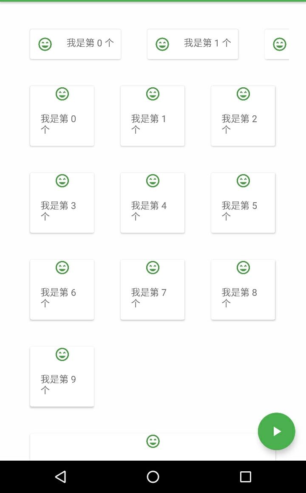
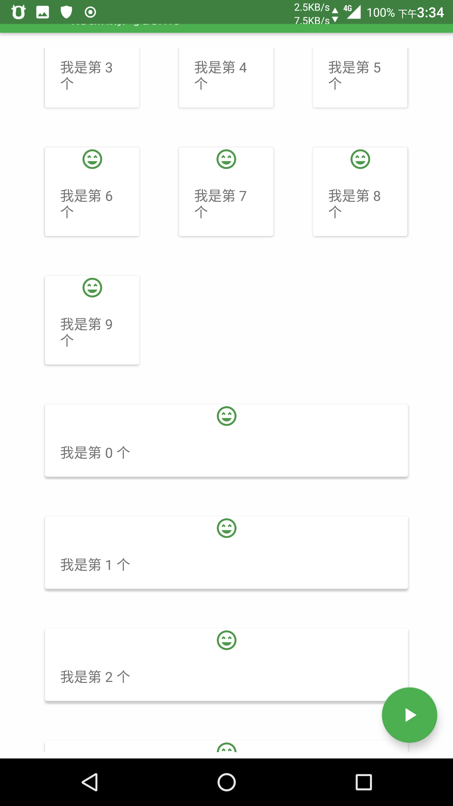

#kotlin协程练习demo

使用主协程并发运行子协程，切换协程到UI协程与IO协程。

### v1.2
#### 增加Design库组件的使用示例
#### 例如：底部栏，底部弹出Sheet，新的CardView，MaterialBtn，底部导航栏，tabLayout布局。

### v1.1
#### 内部使用了部分Design库的组件。
#### 增加shortCuts的支持。
#### 增加RecyclerView的示例

